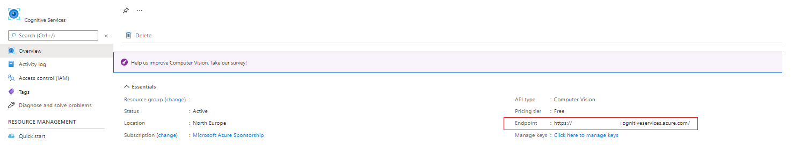

# Computer vision poc

Spring boot µService using the ComputerVision cognitive service from Azure [https://azure.microsoft.com/en-us/services/cognitive-services/computer-vision/](https://azure.microsoft.com/en-us/services/cognitive-services/computer-vision/)

- Extracts all features from an image
- Reads all text from an image
- Checks if an image has a person in it

## Pre-req

in `application.yml` will need two values from azure a running `computer vision`

``````yaml
azure:
  subscription-key: <you subscription key>
  cognitive-service-endpoint: https://<your endpoint>.cognitiveservices.azure.com/
``````

The endpoint can be found in the azure portal




## Build

`mvn clean install`

## Run local

`mvn spring-boot:run`

Defaults to running on [http://localhost:8082/swagger-ui.html](http://localhost:8082/swagger-ui.html)

Extract text from an image using `/api/vision/readtext`

- `imagePath` : relative classpath location for an image defaults to `src\main\resources\images\model_front.jpg`

Classify all features and then identify if a person is found in the image using `/api/vision/modelimage`

- `imagePath` : relative classpath location for an image defaults to `src\main\resources\images\model_front.jpg`

Classify all features found in the image using `/api/vision/modelimage`

- `imagePath` : relative classpath location for an image defaults to `src\main\resources\images\model_front.jpg`
